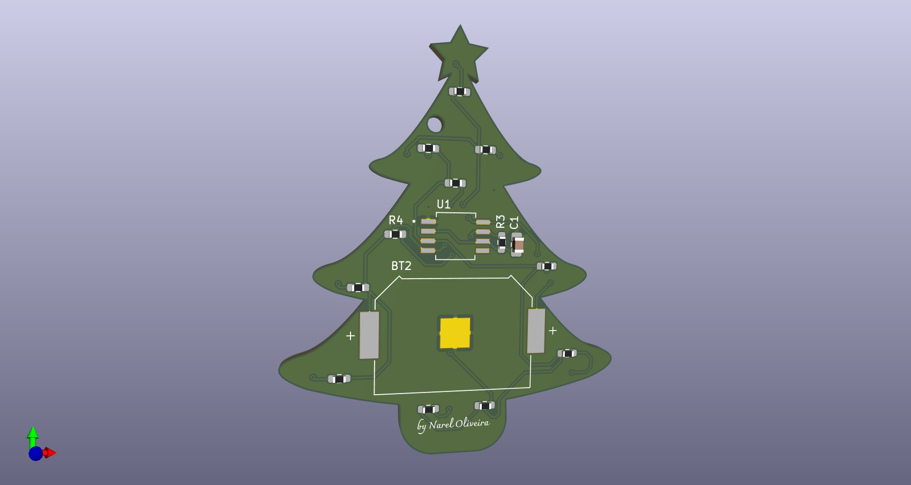

# christmas-hardware
A led-blink board inspired on a christmas tree.

The project was made as a minimalist circuit using the NE555 counter, and with an artistic PCB design, that resembles some christmas symbol.

